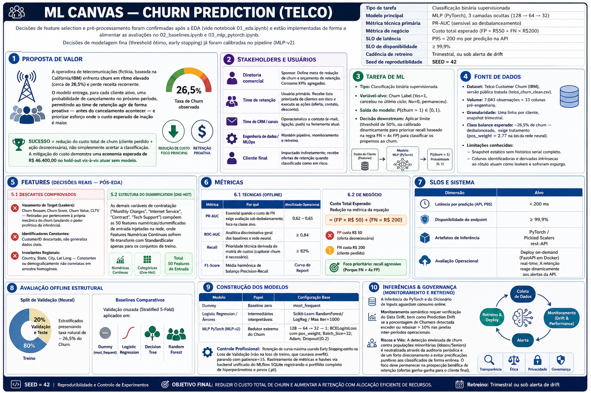

# Previsão de Churn em Telecomunicações


Projeto de entrega final da **Fase 01** da Pós-Graduação em Machine Learning Engineering da **FIAP**, focado no desenvolvimento ponta a ponta de um modelo de Machine Learning para prever o churn (cancelamento) de clientes em uma operadora de telecomunicações. 

O projeto abrange desde a exploração inicial de dados (EDA) até o deploy de uma API utilizando redes neurais (PyTorch) e baselines no Scikit-Learn, com tracking de experimentos via MLflow.

## 📖 Contexto do Negócio

Uma operadora de telecomunicações está perdendo clientes em ritmo acelerado. A diretoria precisa de um **modelo preditivo de churn** que classifique os clientes atuais com risco iminente de cancelamento.

O objetivo do projeto é atuar em todo o ciclo de vida dos dados: construir a solução do zero, partindo da modelagem analítica e terminando com o modelo servido via API, aplicando as melhores práticas de Engenharia de Machine Learning.

## 📊 O Dataset (Telco Customer Churn: IBM)

O dataset utilizado é o **Telco customer churn: IBM dataset** (base samples dataset do IBM Cognos Analytics 11.1.3+). Ele traz dados de uma empresa fictícia de telecomunicações que forneceu serviços de telefonia fixa e internet para **7.043 clientes na Califórnia** durante o terceiro trimestre.

Os dados contemplam:
- **Demografia:** Gênero, idade (Senior Citizen), dependentes e parceiros.
- **Localização:** País, Estado, Cidade, CEP e Coordenadas (embora algumas destas possam ser removidas no pré-processamento por falta de generalização).
- **Serviços:** Telefone fixo, múltiplas linhas, tipo de internet, segurança online, suporte técnico, streaming, entre outros.
- **Faturamento e Contrato:** Tipo de contrato, método de pagamento, cobrança mensal e total acumulado.
- **Variável Alvo (Target):** `Churn Label` e `Churn Value`, indicando se o cliente cancelou o serviço no trimestre vigente.

## 📁 Estrutura do Projeto

```text
├── data/               # Conjuntos de dados brutos e processados
├── docs/               # Documentação técnica (Model Card, Monitoramento, Arquitetura)
├── notebooks/          # Notebooks de EDA e desenvolvimento de modelos iniciais
├── models/             # Modelos serializados, scalers e artefatos (outputs do MLflow)
├── src/                # Código fonte principal
│   ├── api/            # API de inferência usando FastAPI
│   ├── data/           # Scripts de ingestão e pré-processamento
│   ├── models/         # Arquiteturas de modelos (PyTorch)
│   └── training/       # Pipeline de treinamento e tracking
├── tests/              # Testes automatizados (pytest, pandera)
├── Makefile            # Comandos úteis de build e execução
├── pyproject.toml      # Configuração de dependências e linting
└── README.md           # Documentação principal do projeto
```

## 🚀 Setup e Instalação

Pré-requisitos: Python 3.10 ou superior. Recomendado uso de ambiente virtual (`venv` ou `conda`).

1. **Clonar o repositório:**
   ```bash
   git clone https://github.com/MateusSouza74/Tech-Challenge-01.git
   cd Tech-Challenge-01
   ```

2. **Criar e ativar um ambiente virtual:**
   ```bash
   python -m venv .venv
   
   # Windows (PowerShell)
   .\.venv\Scripts\activate
   
   # Linux/MacOS
   source .venv/bin/activate
   ```

3. **Instalar as dependências:**
   ```bash
   # Opção com Make:
   make install
   
   # Opção com Python/Pip:
   pip install -e ".[dev]"
   ```

## 💻 Execução

Todos os comandos do projeto podem ser executados via **`make`** ou diretamente com **`python -m`**. O uso de `python -m` garante compatibilidade total com **Windows**, onde os executáveis do pip nem sempre estão no PATH.

> **Antes de executar qualquer comando abaixo**, certifique-se de estar dentro do diretório `Tech-Challenge-01` e com o ambiente virtual ativado:
> ```bash
> cd Tech-Challenge-01
> .\.venv\Scripts\activate   # No Windows
> source .venv/bin/activate   # No Linux/MacOS
> ```

### 1. Treinar os modelos
Executa o treinamento da MLP e registra os resultados no MLflow local. Este passo gera os artefatos necessários para a API e os testes. Cada execução é registrada com um **nome descritivo** no formato `ChurnMLPv2_lr{lr}_bs{batch}_pat{patience}_{timestamp}`, facilitando a identificação das runs.
- **Opção com Make:** `make train`
- **Opção com Python:** `python -m src.training.train`

Para visualizar a interface do MLflow e acessar `http://127.0.0.1:5000`:
- **Opção com Make:** `make mlflow`
- **Opção com Python:** `python -m mlflow ui`

### 2. Rodar os testes
Garantir o funcionamento da pipeline, esquemas de dados, modelo e API (26 testes cobrindo 4 categorias: smoke, schema, preprocessing e API).
- **Opção com Make:** `make test`
- **Opção com Python:** `python -m pytest tests/ -v`

### 3. Rodar o linting
Garantir a qualidade do código com `ruff`.
- **Opção com Make:** `make lint`
- **Opção com Python:** `python -m ruff check src/ tests/`

### 4. Rodar a API FastAPI localmente
Iniciar o servidor de inferência.
- **Opção com Make:** `make run`
- **Opção com Python:** `python -m uvicorn src.api.api:app --reload`

> **Acessar a documentação interativa (Swagger UI) em:** `http://127.0.0.1:8000/docs`

#### Exemplo de payload para o endpoint `/predict`

Via Swagger UI ou qualquer cliente HTTP, envie um POST para `/predict` com o seguinte JSON:

```json
{
  "Count": 1,
  "Zip Code": 90210,
  "Latitude": 34,
  "Longitude": -118,
  "Tenure Months": 2,
  "Monthly Charges": 95.00,
  "Total Charges": 190.00,
  "Gender": "Male",
  "Senior Citizen": "No",
  "Partner": "No",
  "Dependents": "No",
  "Phone Service": "Yes",
  "Multiple Lines": "No",
  "Internet Service": "Fiber optic",
  "Online Security": "No",
  "Online Backup": "No",
  "Device Protection": "No",
  "Tech Support": "No",
  "Streaming TV": "No",
  "Streaming Movies": "No",
  "Contract": "Month-to-month",
  "Paperless Billing": "Yes",
  "Payment Method": "Electronic check"
}
```

Resposta esperada:
```json
{
  "churn_probability": 0.8234,
  "churn_prediction": true
}
```

## 📚 Documentação Adicional

Documentações detalhadas do projeto na pasta `docs/`:

- [ML Canvas (Business)](docs/ml_canvas.md) - Contexto de negócio, métricas e SLOs.
- [Model Card](docs/model_card.md) - Detalhes da rede neural, limitações, vieses e performance.
- [Arquitetura de Deploy](docs/deployment_architecture.md) - Estratégia de serviço (Real-time vs Batch).
- [Plano de Monitoramento](docs/monitoring_plan.md) - Alertas e mitigação de data drift/concept drift.

## 🧠 ML Canvas


## 👥 Autores

| Nome                                | Função no Projeto                               | GitHub                              |
| :---------------------------------- | :---------------------------------------------- | :---------------------------------- |
| **Mateus de Souza Nascimento**      | Analyst / DevOps / Data Scientist / ML Engineer | https://github.com/MateusSouza74    |
| **Raphael Dyorgenes Vitor**         | Analyst / DevOps / Data Scientist / ML Engineer | https://github.com/RaphaelDyorgenes |

## 📄 Licença

Este projeto está licenciado sob a **Licença MIT** — veja o arquivo [LICENSE](LICENSE) para detalhes.
