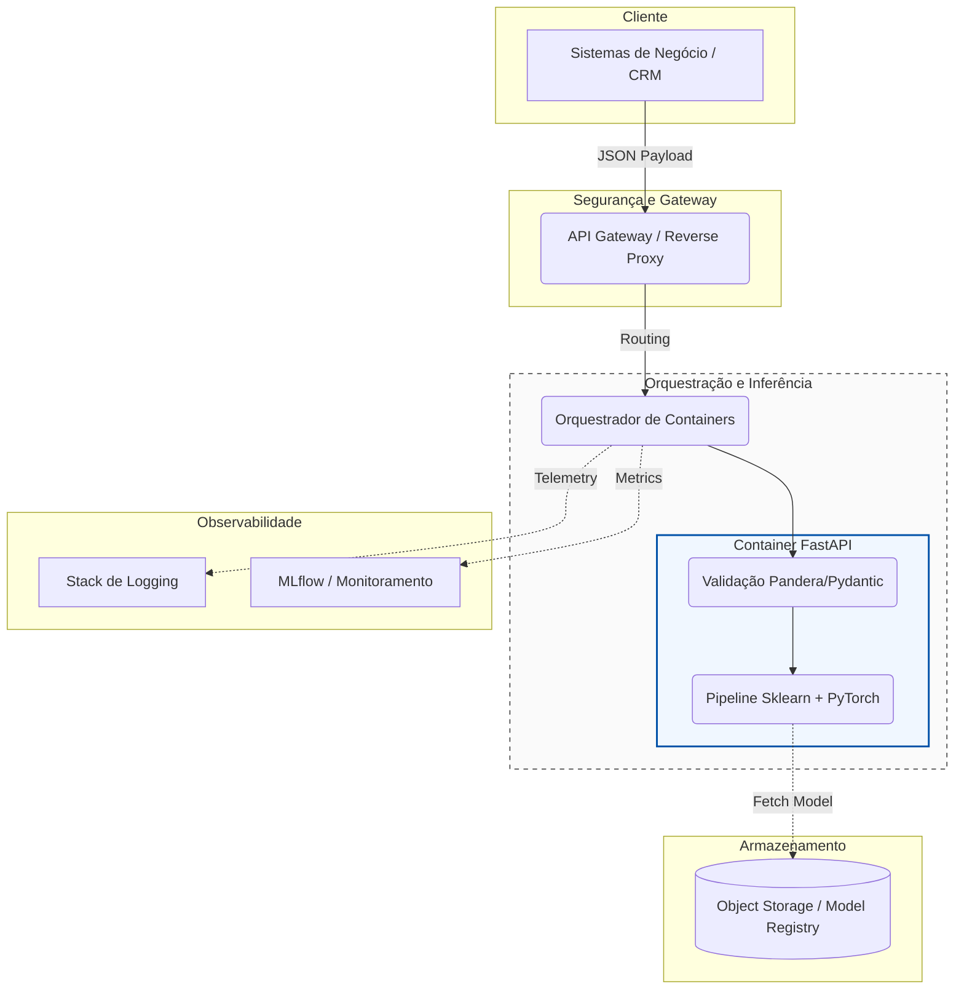

# Arquitetura de Deploy

Para operacionalizar o modelo de previsão de churn, foi definida uma arquitetura baseada em conteinerização e agnóstica de provedor de nuvem, garantindo alta disponibilidade e portabilidade para qualquer ambiente corporativo (On-Premise ou Cloud).

## 1. Justificativa: Real-Time vs Batch Deploy

Foi definido o uso de um modelo híbrido com foco predominante no **Real-Time (Online Inference)** através da API FastAPI.
- **Motivo para o Real-Time**: As equipes de call center (Retenção) precisam de uma pontuação de churn em tempo real assim que o cliente entra em contato (inbound call) ou quando o perfil do cliente sofre uma alteração brusca. Ter a API permite que o CRM consuma o score dinamicamente.
- **Batch Processing Opcional**: Para ações massivas mensais de e-mail marketing, uma DAG (ex: Apache Airflow) pode bater no endpoint da API ou carregar o objeto do modelo do repositório de artefatos diretamente para gerar scores em lote para toda a base.

## 2. Desenho Arquitetural

## 3. Componentes Principais

- **Docker & Orquestração de Containers**: A API desenvolvida com FastAPI será empacotada em um container Docker, garantindo reprodutibilidade. Um orquestrador (como Kubernetes ou Docker Swarm) escalará as réplicas automaticamente dependendo do volume de predições e monitorará o _health check_ dos serviços.
- **Model Registry via Object Storage**: O MLflow grava os artefatos de treinamento em um armazenamento de objetos (como MinIO, S3-compatible, etc). O container FastAPI busca o modelo validado em produção diretamente deste repositório ao inicializar.
- **API Gateway / Reverse Proxy**: Serviços como Nginx ou Traefik fornecem um endpoint HTTPs seguro, lidam com rate-limiting, balanceamento de carga e garantem a autenticação antes de enviar o payload para os nós do FastAPI.
- **Observabilidade**: Os logs estruturados configurados no FastAPI são exportados para uma plataforma de observabilidade centralizada (como Elasticsearch/Kibana ou Grafana Loki). O sistema reportará tempos de resposta, métricas de negócio e falhas HTTP para disparar alarmes em caso de anomalias.

## 4. CI/CD e Pipeline

1. **Commit na branch `main`**.
2. **Esteira de CI (Continuous Integration)** (ex: GitHub Actions, GitLab CI): 
   - Dispara os testes unitários (`pytest`), validações de estilo (`ruff`) e esquema de dados.
   - Se os testes passarem com sucesso, o pipeline constrói a nova versão da imagem Docker.
   - Publica a imagem em um Container Registry corporativo seguro.
3. **Deploy Contínuo (CD)**:
   - O orquestrador atualiza os nós de inferência utilizando a estratégia de *Rolling Update*, o que garante a implantação da nova versão do modelo sem causar inatividade (zero downtime).

